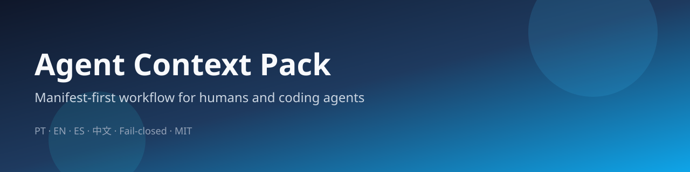

<p align="center">
  
</p>

<p align="center">
  <strong>A context operating system for humans and coding agents</strong><br/>
  Manifest-first · two vaults · fail-closed AppSec · S/M/C effort · PT · EN · ES · 中文
</p>

<p align="center">
  <a href="docs/pt/README.md"></a>
  <a href="docs/en/README.md"></a>
  <a href="docs/es/README.md"></a>
  <a href="docs/zh/README.md"></a>
</p>

<p align="center">
  
  
  
  
  
  
</p>

<p align="center">
  
  
  
  
  
  
</p>

<p align="center">
  <a href="https://github.com/alexander-stack1/agent-context-pack/stargazers"></a>
  <a href="https://github.com/alexander-stack1/agent-context-pack/commits/main"></a>
  
</p>

---

# Agent Context Pack

Most agent setups fail the same way: prompts live in chat memory, rules drift, secrets leak into “helpful” examples, and every new model relearns your workflow from scratch.

**Agent Context Pack** is a reusable, **public template** for a personal (or team) **context OS**:

1. One **Manifest** agents must read before non-trivial work  
2. Hard **agent rules** (no invention, tools over memory, fail-closed security)  
3. **Working style** with S / M / C effort classes  
4. **AppSec playbook** you can copy into audits  
5. **Identity / brand / stack** skeletons with placeholders  
6. **UX criteria** for agent-built UI  
7. **Repo boot templates** (`CLAUDE.md`, maps, decisions)

This repo ships **scrubbed** content only. Real names, firms, products, emails, and paths are replaced by tokens like `[YOUR_NAME]` and `[DOMAIN_VAULT]`. See [`PLACEHOLDERS.md`](PLACEHOLDERS.md). Keep a **private overlay** for your real board, vaults, and secrets.

## Why this shape

| Problem | What this pack does |
|---|---|
| Agents invent when evidence is missing | Fail-closed rules: mark **UNVERIFIED**, never fill gaps |
| Context is scattered across chats | Canonical files under `docs/<lang>/` beat chat memory |
| Domain knowledge gets improvised | Two-vault routing: ops vs domain second brain |
| Tiny edits and prod auth get the same ceremony | S / M / C effort classes match blast radius |
| Public templates leak private life | Placeholders + leak-scan posture before publish |

## Choose your language

| | Language | Start here |
|---|---|---|
| 🇧🇷 | Português | [`docs/pt/README.md`](docs/pt/README.md) |
| 🇺🇸 | English | [`docs/en/README.md`](docs/en/README.md) |
| 🇪🇸 | Español | [`docs/es/README.md`](docs/es/README.md) |
| 🇨🇳 | 中文 | [`docs/zh/README.md`](docs/zh/README.md) |

Each language folder contains the **full Camada 1** (not summaries): Manifest, rules, working-style, AppSec, identity, brand, stack, implementer DoD, UX pack, and templates.

## Mental model (60 seconds)

```text
                 ┌─────────────────────┐
                 │   MANIFEST.md       │  read first
                 └─────────┬───────────┘
                           │
         ┌─────────────────┼─────────────────┐
         ▼                 ▼                 ▼
  agent_rules.md    working-style.md   appsec-rules.md
  (hard rules)      (S/M/C + collab)    (fail-closed)
         │                 │                 │
         └────────┬────────┴────────┬────────┘
                  ▼                 ▼
           [OPS_VAULT]        [DOMAIN_VAULT]
        capture→wiki→MOCs    domain second brain
```

**Domain asks** (law, research, domain RAG, etc.): **all** AIs consult `[DOMAIN_VAULT]` before inventing.  
**Ops / Karpathy notes**: `[OPS_VAULT]` (`raw/` → `wiki/` → indexes).

## What’s inside (Camada 1)

| File | Role |
|---|---|
| `MANIFEST.md` | Orientation + pointers (open this first) |
| `agent_rules.md` | Universal hard rules for any assistant |
| `working-style.md` | Collaboration, research, engineering, S/M/C |
| `appsec-rules.md` | Copyable fail-closed AppSec playbook |
| `senior-implementer-instructions.md` | DoD, TDD, staged writes |
| `identity.md` / `brand-voice.md` / `stack.md` / `about-me.md` | Skeletons with placeholders |
| `ux-ui-*.md` | Criteria + landing + mobile + intake |
| `templates-agent/` | Repo boot (`CLAUDE.md`, map, decisions) |
| `EXAMPLE_ACTIVE_PROJECTS.md` | **Fictional** board only |
| `PLACEHOLDERS.md` | Token legend |

## Quick start

```bash
git clone https://github.com/[YOUR_GITHUB]/agent-context-pack.git
cd agent-context-pack
```

1. Pick a language under `docs/<lang>/`  
2. Replace placeholders from [`PLACEHOLDERS.md`](PLACEHOLDERS.md) in a **private** fork or overlay  
3. Point agents at `MANIFEST.md` + `agent_rules.md`  
4. Wire `[OPS_VAULT]` and `[DOMAIN_VAULT]` to your real vault paths (private)  
5. Never publish the filled private copy

## Privacy & security posture

- No credential folders in this tree  
- No private vault contents  
- No real client/project board (example only)  
- Secrets represented as `[REDACTED]` in rules  
- Authorization is **server-side**; UI checks do not count  
- Leak-scan before every public release (latest local scan: **0 identity hits**)

## Repo layout

```text
.
├── README.md              ← you are here (hub + badges)
├── PLACEHOLDERS.md
├── LICENSE                ← MIT
├── assets/banner.svg      ← header / social art
├── templates-agent/       ← shared boot templates
└── docs/
    ├── pt/ …              ← full Camada 1
    ├── en/ …
    ├── es/ …
    └── zh/ …
```

## Suggested GitHub topics (after publish)

`agents` · `llm` · `cursor` · `claude` · `prompt-engineering` · `appsec` · `obsidian` · `knowledge-management` · `fail-closed`

## Roadmap for the public page (optional)

- [ ] Live shields: stars / last-commit / repo-size  
- [ ] Social preview PNG from `assets/banner.svg`  
- [ ] Discussions enabled for Q&A  
- [ ] Short “diff your private overlay” guide

## License

MIT — see [`LICENSE`](LICENSE). Use freely; keep your private data private.
